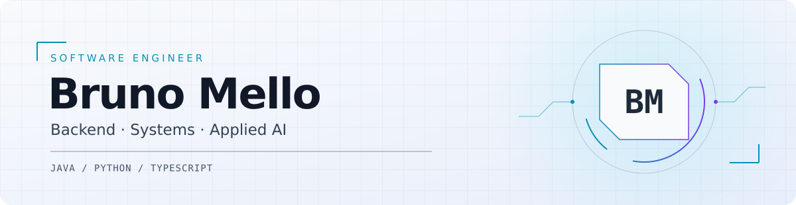

<picture>
  <source media="(prefers-color-scheme: dark)" srcset="./assets/header-dark.svg">
  
</picture>

# Bruno Mello

**Software Engineer · Backend & Systems**

Professional software development since **2019**. I work with **Java / Spring Boot**, Python and TypeScript, with experience in business systems and API integration. My public work explores persistent runtimes, event-driven game systems, accessible web apps and edge robotics.

[LinkedIn](https://www.linkedin.com/in/sbrunomello/) · [Email](mailto:sbrunomello@gmail.com) · [Engineering notes](./PORTFOLIO.md)

## Selected engineering work

These are implemented projects. Each entry links to a concrete part of the code; the engineering notes describe their current limits.

| Project | What to inspect | Stack |
| :--- | :--- | :--- |
| [EarthCore](https://github.com/sbrunomello/EarthCore) | [Domain services and persistence](https://github.com/sbrunomello/EarthCore/tree/main/src/main/java/mello): economy, territorial claims, skills and server events. | Java 21 · Paper |
| [trader-assistant](https://github.com/sbrunomello/trader-assistant) | [Temporal validation](https://github.com/sbrunomello/trader-assistant/blob/main/core/backtest/walk_forward.py), [OOS tests](https://github.com/sbrunomello/trader-assistant/blob/main/tests/test_backtest_oos.py) and risk-aware paper execution. | Python · FastAPI · SQLite |
| [fala-comigo](https://github.com/sbrunomello/fala-comigo) | [Speech and local storage](https://github.com/sbrunomello/fala-comigo/tree/main/src/core): an offline-capable communication PWA with privacy and sensory accessibility in its design. | JavaScript · Web APIs |
| [urubu-vegas](https://github.com/sbrunomello/urubu-vegas) | [Server-side round processing](https://github.com/sbrunomello/urubu-vegas/blob/main/src/server/urubuVegas/roundService.ts), deterministic tests and Redis transactions. Virtual-credit arcade parody. | TypeScript · Hono · Redis |
| [pce-python-engine](https://github.com/sbrunomello/pce-python-engine) | [Plugin contracts](https://github.com/sbrunomello/pce-python-engine/blob/main/pce-core/src/pce/core/plugins.py), persistent state and explicit approval transitions in an experimental agent runtime. | Python · FastAPI · SQLAlchemy |
| [NeuroMesh](https://github.com/sbrunomello/NeuroMesh) | [Actuator validation](https://github.com/sbrunomello/NeuroMesh/blob/main/neuromesh/apps/neuromesh-edge/app/modules/motion/actuator_service.py), bounded command queues and core/edge integration tests. Experimental foundation. | Python · FastAPI · OpenCV |

## How I approach engineering

- Define contracts and boundaries before expanding a system.
- Test behavior, failure paths and replay/idempotency where they matter.
- Keep simulation, hardware adapters and external integrations explicit.
- Make projects inspectable through source, setup instructions and technical decisions.

## Core tools

**Backend:** Java, Spring Boot, Python, FastAPI, PostgreSQL and SQLite  
**Interfaces:** TypeScript, Angular and native browser APIs  
**Systems:** Linux, Git, event-driven integration and resource-constrained hardware

I enjoy building across software and the physical world. The same questions follow me: what is the contract, how does it fail, and how can someone else reproduce it?
